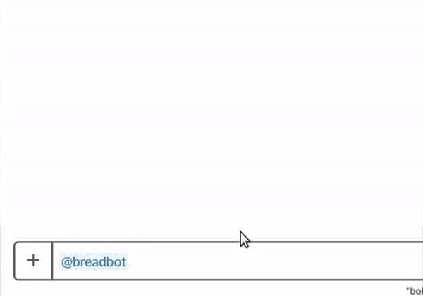

# breadbot
#### _A Slack bot that assists with acquiring that bread_ 🍞

_breadbot recognizes much more!_

## Running Locally
* Clone repo
* Run `npm install`
* Create a `Config.ts` file
    * Use `src/Config-template.ts` to fill in your OAuth credentials
    * Rename `src/Config-template.ts` to `src/Config.ts`
* Run `npm build` to build your bot in the `dist/` folder
* Run `npm start` to boot up your 🍞bot
